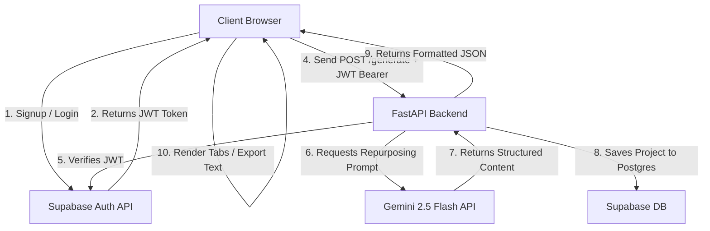

# Reprop.io - Master System Handbook

This document is the definitive guide to the architecture, features, security implementations, database models, and deployment configurations of the **Reprop.io** SaaS application.

---

## 1. System Architecture & Data Flow

Reprop.io uses a decoupled, three-tier architecture:
1. **Frontend (React)**: Handles interactive state, local file parsing, authentication UI, and rendering AI results.
2. **Backend Gateway (FastAPI)**: Serves as a secure orchestrator. It verifies user sessions, interacts with the LLM, and logs data in the database.
3. **Infrastructure Layer (Supabase & Google Gemini)**: Handles storage, user accounts, and AI text generation.

### High-Level Data Flow Diagram



---

## 2. Comprehensive Feature Catalog

### 2.1 — Minimalist Design System
- Built to mirror modern SaaS platforms (like Vercel and Linear).
- CSS Variables set up with HSL values for precision. Dark mode uses a solid `#0A0A0A` background with clean, high-contrast white text and fine `#2A2A2A` borders.
- Styled using Tailwind CSS v4 and Custom components (like our `Button` wrapper).

### 2.2 — Source Code File Ingestion
- Integrated a native HTML5 `FileReader` inside the `ContentInput` component.
- Users can select `.txt`, `.md`, `.csv`, or `.json` files to instantly load long-form source scripts directly into the project workspace.

### 2.3 — Export & Clipboard Integration
- **Copy**: One-click extraction that writes the highlighted text selection directly to the system clipboard via `navigator.clipboard`.
- **Text Export**: Instantly downloads the selected post formatting in a clean `.txt` format utilizing memory Blob URLs (`URL.createObjectURL(blob)`), eliminating the need for server-side file hosting or download pipelines.

### 2.4 — Navigation State Passing
- When text and platform settings are filled on the home dashboard, clicking **Go to Project** redirects the user to the workspace.
- The router passes the configurations as `route state`, allowing `/project/new` to pre-populate inputs without making duplicate database requests or losing state.

### 2.5 — Sidebar History Management
- The sidebar runs a mount-effect (`useEffect`) retrieving the user's active projects from the database.
- It displays titles generated dynamically using the first 30 characters of their source document.
- Clicking any item routes the page to `/project/{id}`, loading their exact context from the server.

---

## 3. Database Architecture & Security Model

The database is built on Supabase PostgreSQL. It is locked down via Row Level Security (RLS) to keep data strictly sandboxed between users.

### Table Schema DDL: `projects`
```sql
create table projects (
  id uuid default gen_random_uuid() primary key,
  user_id uuid references auth.users not null,
  original_content text not null,
  platforms text not null,
  generated_data jsonb not null,
  created_at timestamp with time zone default timezone('utc'::text, now()) not null
);
```

### Row Level Security (RLS) Policies
By default, all tables in Supabase block read/write operations. We created policies mapping directly to Postgres authentication functions:

1. **Read Access (Select)**: Matches the database request UUID to the active token's user ID.
   ```sql
   create policy "Users can view their own projects."
     on projects for select using ( auth.uid() = user_id );
   ```
2. **Write Access (Insert)**: Prevents session forging by ensuring the input `user_id` strictly matches the token's signature.
   ```sql
   create policy "Users can insert their own projects."
     on projects for insert with check ( auth.uid() = user_id );
   ```

---

## 4. API Endpoints Specification

All backend endpoints (except `/`) are secure and require a valid headers authorization token: `Authorization: Bearer <JWT>`.

### 4.1 — `POST /generate`
Generates repurposed assets from source material.
- **Request Body (JSON)**:
  ```json
  {
    "content": "Minimal 10, max 5000 character string...",
    "platform": "linkedin, x"
  }
  ```
- **Response Body (JSON)**:
  ```json
  {
    "linkedin": "Formatted post markdown...",
    "x": "Thread items...",
    "instagram": "Visual post caption...",
    "tiktok": "Video presentation script...",
    "newsletter": "Email newsletter format..."
  }
  ```

### 4.2 — `GET /projects`
Returns a list of all projects belonging to the logged-in user, ordered by date.
- **Response Body (JSON)**:
  ```json
  [
    {
      "id": "e4b29c...",
      "user_id": "3b2c1a...",
      "original_content": "Full text...",
      "platforms": "linkedin, x",
      "generated_data": { ... },
      "created_at": "2026-06-29T10:00:00Z"
    }
  ]
  ```

### 4.3 — `GET /projects/{project_id}`
Returns details for a single project. Returns `404` if not found or unauthorized.
- **Response Body (JSON)**:
  ```json
  {
    "id": "e4b29c...",
    "user_id": "3b2c1a...",
    "original_content": "Full text...",
    "platforms": "linkedin, x",
    "generated_data": { ... },
    "created_at": "2026-06-29T10:00:00Z"
  }
  ```

---

## 5. Security Architecture (The 4-Layer Model)

To protect the application from data leaks, brute-forcing, and API cost inflation, we implemented a layered defense strategy:

| Layer | Security Target | Technology Used | Implementation Details |
|---|---|---|---|
| **Layer 1** | Network & Headers | FastAPI CORS & Middleware | CORS domain strict restriction list. Secure response headers injected: `nosniff`, `X-Frame-Options: DENY`, `X-XSS-Protection`. |
| **Layer 2** | Access Control | Supabase JWT & Bearer Tokens | Verification of JWT tokens via `get_current_user` dependency. Any invalid signatures are immediately returned with a `401 Unauthorized` response. |
| **Layer 3** | App Abuse Protection | `slowapi` Rate Limiter & Pydantic | Limiting the `/generate` endpoint to a maximum of **5 queries per minute per IP address**. Strict string constraints (max 5000 chars) prevent buffer/payload injection attacks. |
| **Layer 4** | Database Storage | PostgreSQL RLS | Supabase RLS policies block unauthorized users from querying rows, even if they have direct access to database routes. |

---

## 6. Environment Configurations Matrix

Ensure your configuration hosts (Render & Vercel) have the following environment variables configured:

### Frontend Environment Variables (Vercel)
- `VITE_SUPABASE_URL`: The project API endpoint from Supabase.
- `VITE_SUPABASE_ANON_KEY`: The public anonymous key for database/auth handshake.
- `VITE_API_URL`: The live endpoint address of your Render FastAPI service (e.g., `https://your-backend.onrender.com`).

### Backend Environment Variables (Render)
- `GEMINI_API_KEY`: Your model API access key generated in Google AI Studio.
- `SUPABASE_URL`: Matches the frontend Supabase URL.
- `SUPABASE_SERVICE_ROLE_KEY`: Secret administrative key allowing backend DB writes (stored strictly backend-side).

---

## 7. Scaling Blueprint

As Reprop.io scales to support hundreds of concurrent users, follow this optimization plan:

### 1. Database Connection Pooling
- **Problem**: When traffic spikes, FastAPI opening direct connections to Supabase PostgreSQL for every transaction will exhaust database connection limits.
- **Solution**: Switch the backend client to Supabase's transaction pooler port (`6543`) with PgBouncer to throttle and queue connection queries.

### 2. Response Caching
- **Problem**: Users clicking back and forth between past project links makes repeated requests to the database, creating unnecessary query costs.
- **Solution**: Set up a Redis cache on your backend hosting provider, or use client-side caching (like React Query) to cache project data for 5–10 minutes.

### 3. Server Warmth & Performance
- **Problem**: The free tier of Render spins down the backend container after 15 minutes of inactivity, creating a "cold start" wait of ~30-50 seconds for the next visitor.
- **Solution**: Upgrade to Render's starter service tier ($7/month) to keep the environment warm 24/7.

### 4. LLM Fallback Protocols
- **Problem**: Spikes in global usage can make Google's Gemini models temporarily return a `503 Unavailable` error.
- **Solution**: Implement retry mechanisms with exponential backoff (e.g., using `tenacity` library) and fallback logic to rotate API keys or switch to alternative models (like `gemini-1.5-flash` or `gemini-1.5-pro`) automatically.
